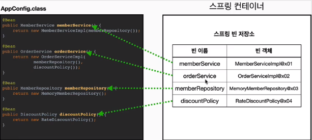
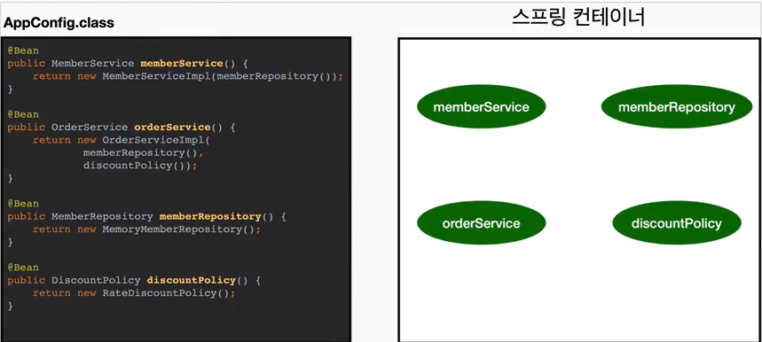
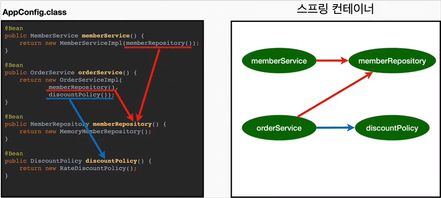
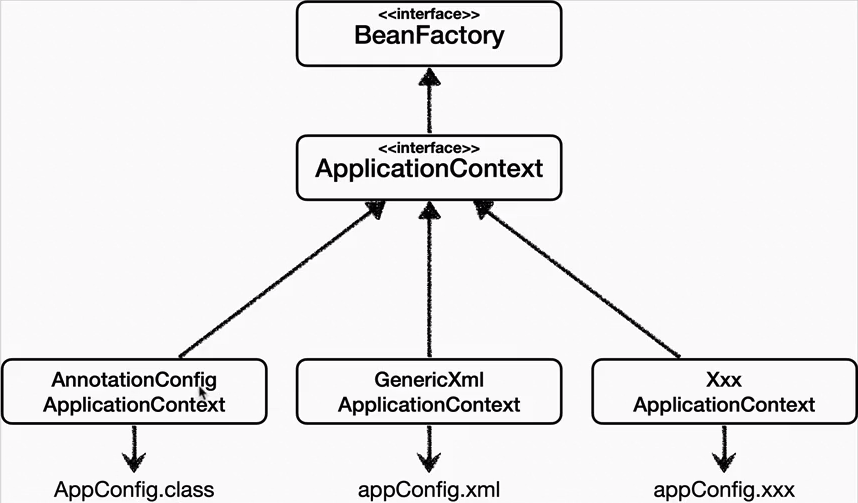

### Spring Container 생성

- `ApplicationContext`를 `SpringContainer` 라고 한다.
- `ApplicationContext`는 인터페이스이다.
- `SpringContainer`는 XML 기반으로 만들 수 있으며, Annotation 기반으로 만들 수 있다.
- Java 설정 Class 기반으로 `SpringContainer`를 만드는 법
    1. `new AnnotationConfigApplicationContext(AppConfig.class);`
    2. `AnnotationConfigApplicationContext`는 `ApplicationContext`의 구현체이다.
- Container란? 객체를 담고 있는 것을 말한다.
- `SpringContainer`는 `BeanFactory`, `ApplicationContext`로 구분지어 이야기한다. 다만 일반적으로 `BeanFactory`를 직접 사용하지
  않고 `ApplicationContext`를 사용한다.

## `SpringContainer`의 생성과정

### 1. `SpringContainer` 생성

- `SpringContainer`에는 SpringBean 저장소가 존재
- `SpringContainer`를 생성할 때는 구성 정보 입력 필요(Java, XML, Annotation): `AppConfig.class`

### 2. `SpringBean` 등록

- `SpringContainer`는 파라미터로 넘어온 설정 클래스(`AppConfig.class`)를 사용하여 `SpringBean`을 등록한다.
  *Bean 이름*
- `SpringBean`의 이름은 기본적으로 메서드 이름을 사용한다.
- `SpringBean`의 이름을 직접 부여할 수 있다.
    - `@Bean(name = "memberService2")`

*주의: Bean 이름은 항상 다른 이름을 부여*해야 한다.
동일한 이름으로 선언되는 경우, 다른 Bean이 무시되거나, 기존 Bean을 덮어버리거나 설정에 따라 오류가 발생한다.
**최근**에는 중복으로 선언된 경우 `SpringBoot`에서 오류를 발생시킨다.

### 3. *`SpringBean` 의존관계 설정-준비*

### 4. *`SpringBean` 의존관계 설정-완료*

- `SpringContainer`는 설정 정보를 참고하여 의존관계를 주입(DI)한다.
- `SpringBean`을 생성하고 의존관계를 주입하는 단계를 **생성과정**이라 한다.
- 생성과정을 거치면서 의존관계 주입이 완료된 `SpringBean`은 `SpringContainer`에서 관리한다.
- 단순하게 Java 코드를 호출하는 것 같지만 차이가 존재함.

### 모든 Bean 출력하기

- `SpringContainer`에 등록된 모든 `SpringBean`을 조회할 수 있다.
- `applicationContext.getBeanDefinitionNames()`를 사용하면 등록된 모든 `SpringBean`의 이름을 조회할 수 있다.
- `applicationContext.getBean()`을 사용하면 등록된 모든 `SpringBean`(Instance)을 조회할 수 있다.

### Application Bean 출력하기

- `Spring`이 내부에서 사용하는 Bean은 제외, 내가 등록한 Bean만 출력하고 싶다면?
    - `applicationContext.getBeanDefinitionNames()`로 모든 Bean 이름을 조회한 후, `getRole()`로 역할을 출력한다.
        - `ROLE_APPLICATION`: 내가 등록한 Bean
        - `ROLE_INFRASTRUCTURE`: 내가 등록한 Bean이 아니라 `Spring`이 내부에서 사용하는 Bean

## `BeanFactory`와 `ApplicationContext`

### `BeanFactory`

- `SpringContainer`의 최상위 인터페이스
- `SpringBean`을 관리하고 조회하는 역할을 담당한다.
- `getBean()`을 제공한다.
- 지금까지 우리가 사용했던 대부분의 기능은 `BeanFactory`가 제공하는 기능이다.

### `ApplicationContext`

- `BeanFactory`의 기능을 모두 상속받아서 제공한다.
- `BeanFactory`와 `ApplicationContext`를 비교했을 때, `ApplicationContext`가 제공하는 부가기능
    - `MessageSource`: 메시지소스를 활용한 국제화 기능
    - `EnvironmentCapable`: 환경변수
    - `ApplicationEventPublisher`: 애플리케이션 이벤트
    - `ResourceLoader`: 편리한 리소스 조회

## 다양한 설정 형식 지원 - 자바 코드, XML
- `SpringContainer`는 다양한 형식의 설정 정보를 받아드릴 수 있게 유연하게 설계되어 있다.
- 자바 코드, XML, Groovy

### Annotation 기반 자바 코드 설정 사용
- `new AnnotationConfigApplicationContext(AppConfig.class);`
- `AnnotationConfigApplicationContext`는 `ApplicationContext`의 구현체이다.
- `AnnotationConfigApplicationContext` 클래스를 사용하면서 Java 코드로 된 설정 정보를 넘기면 된다.

### XML 설정 사용
- `new GenericXmlApplicationContext("appConfig.xml");`
