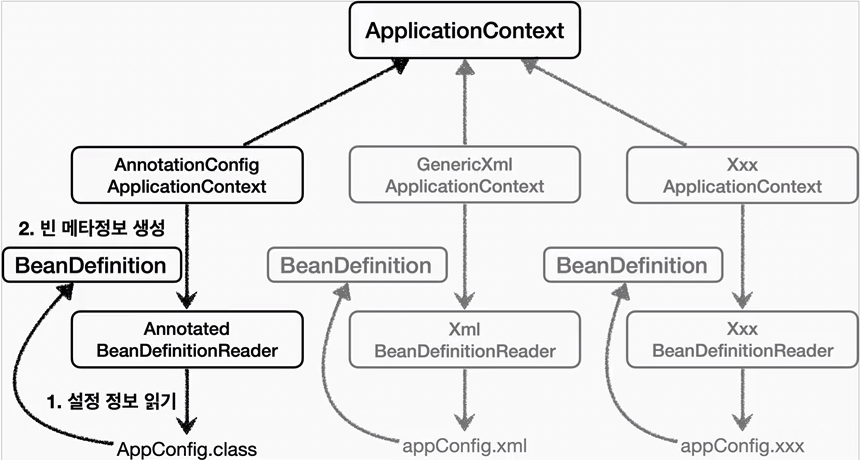
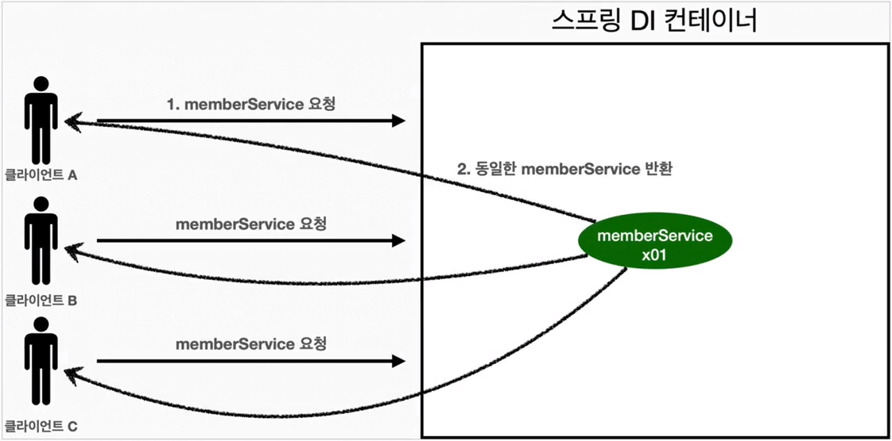

### Spring Container 생성

- `ApplicationContext`를 `SpringContainer` 라고 한다.
- `ApplicationContext`는 인터페이스이다.
- `SpringContainer`는 XML 기반으로 만들 수 있으며, Annotation 기반으로 만들 수 있다.
- Java 설정 Class 기반으로 `SpringContainer`를 만드는 법
    1. `new AnnotationConfigApplicationContext(AppConfig.class);`
    2. `AnnotationConfigApplicationContext`는 `ApplicationContext`의 구현체이다.
- Container란? 객체를 담고 있는 것을 말한다.
- `SpringContainer`는 `BeanFactory`, `ApplicationContext`로 구분지어 이야기한다. 다만 일반적으로 `BeanFactory`를 직접 사용하지
  않고 `ApplicationContext`를 사용한다.

## `SpringContainer`의 생성과정

### 1. `SpringContainer` 생성

- `SpringContainer`에는 SpringBean 저장소가 존재
- `SpringContainer`를 생성할 때는 구성 정보 입력 필요(Java, XML, Annotation): `AppConfig.class`

### 2. `SpringBean` 등록

- `SpringContainer`는 파라미터로 넘어온 설정 클래스(`AppConfig.class`)를 사용하여 `SpringBean`을 등록한다.
  *Bean 이름*
- `SpringBean`의 이름은 기본적으로 메서드 이름을 사용한다.
- `SpringBean`의 이름을 직접 부여할 수 있다.
    - `@Bean(name = "memberService2")`

*주의: Bean 이름은 항상 다른 이름을 부여*해야 한다.
동일한 이름으로 선언되는 경우, 다른 Bean이 무시되거나, 기존 Bean을 덮어버리거나 설정에 따라 오류가 발생한다.
**최근**에는 중복으로 선언된 경우 `SpringBoot`에서 오류를 발생시킨다.

### 3. *`SpringBean` 의존관계 설정-준비*

### 4. *`SpringBean` 의존관계 설정-완료*

- `SpringContainer`는 설정 정보를 참고하여 의존관계를 주입(DI)한다.
- `SpringBean`을 생성하고 의존관계를 주입하는 단계를 **생성과정**이라 한다.
- 생성과정을 거치면서 의존관계 주입이 완료된 `SpringBean`은 `SpringContainer`에서 관리한다.
- 단순하게 Java 코드를 호출하는 것 같지만 차이가 존재함.

### 모든 Bean 출력하기

- `SpringContainer`에 등록된 모든 `SpringBean`을 조회할 수 있다.
- `applicationContext.getBeanDefinitionNames()`를 사용하면 등록된 모든 `SpringBean`의 이름을 조회할 수 있다.
- `applicationContext.getBean()`을 사용하면 등록된 모든 `SpringBean`(Instance)을 조회할 수 있다.

### Application Bean 출력하기

- `Spring`이 내부에서 사용하는 Bean은 제외, 내가 등록한 Bean만 출력하고 싶다면?
    - `applicationContext.getBeanDefinitionNames()`로 모든 Bean 이름을 조회한 후, `getRole()`로 역할을 출력한다.
        - `ROLE_APPLICATION`: 내가 등록한 Bean
        - `ROLE_INFRASTRUCTURE`: 내가 등록한 Bean이 아니라 `Spring`이 내부에서 사용하는 Bean

## `BeanFactory`와 `ApplicationContext`

### `BeanFactory`

- `SpringContainer`의 최상위 인터페이스
- `SpringBean`을 관리하고 조회하는 역할을 담당한다.
- `getBean()`을 제공한다.
- 지금까지 우리가 사용했던 대부분의 기능은 `BeanFactory`가 제공하는 기능이다.

### `ApplicationContext`

- `BeanFactory`의 기능을 모두 상속받아서 제공한다.
- `BeanFactory`와 `ApplicationContext`를 비교했을 때, `ApplicationContext`가 제공하는 부가기능
    - `MessageSource`: 메시지소스를 활용한 국제화 기능
    - `EnvironmentCapable`: 환경변수
    - `ApplicationEventPublisher`: 애플리케이션 이벤트
    - `ResourceLoader`: 편리한 리소스 조회

## 다양한 설정 형식 지원 - 자바 코드, XML

- `SpringContainer`는 다양한 형식의 설정 정보를 받아드릴 수 있게 유연하게 설계되어 있다.
- 자바 코드, XML, Groovy
  

### Annotation 기반 자바 코드 설정 사용

- `new AnnotationConfigApplicationContext(AppConfig.class);`
- `AnnotationConfigApplicationContext`는 `ApplicationContext`의 구현체이다.
- `AnnotationConfigApplicationContext` 클래스를 사용하면서 Java 코드로 된 설정 정보를 넘기면 된다.

### XML 설정 사용

- `new GenericXmlApplicationContext("appConfig.xml");`

### XML 설정과 자바 코드 설정의 장단점

- XML 설정
    - 장점
        - 설정 정보를 변경하고 싶을 때, XML만 변경하면 된다.
        - 프로젝트가 커지면서 설정 정보가 많아지면 XML이 복잡해진다.
        - 스프링 설정을 하다보면, 스프링 코드(Java)와 비교해서 어떤 것이 더 좋다는 것을 느낄 수 있다.
    - 단점
        - 컴파일을 해야해서 런타임시에 오류를 확인할 수 있다.
        - XML 작성이 복잡하다.
- 자바 코드 설정
    - 장점
        - 컴파일 시점에 오류를 확인할 수 있다.
        - 자바 코드로 구현하기 때문에, IDE의 도움을 받을 수 있다.
    - 단점
        - 설정 정보를 변경하려면 자바 코드를 변경해야 한다.
        - 자바 코드를 변경하면 컴파일을 다시 해야 한다.
        - 설정 정보가 컴파일 시점에 다 메모리에 올라가기 때문에, 메모리 낭비가 있을 수 있다.

### `SpringBean` 설정 메타 정보 - BeanDefinition

- Spring은 `BeanDefinition`이라는 추상화를 통해, 다양한 설정 형식을 지원한다.
- **역할과 구현을 개념적으로 나눈 것**이다.
    - XML을 읽어서 `BeanDefinition`을 만들면 된다.
    - 자바 코드를 읽어서 `BeanDefinition`을 만들면 된다.
    - 스프링 컨테이너는 자바 코드인지, XML인지 몰라도 된다. 오직 `BeanDefinition`만 알면 된다.
- `BeanDefinition`을 빈(Bean) 설정 메타정보라 한다.
    - `@Bean`, `<bean>` 당 각각 하나씩 메타 정보가 생성된다.
- SpringContainer는 이 메타 정보를 기반으로 스프링 빈을 생성한다.
  

## Singleton Container

### WebApplication과 Singleton

- 스프링은 태생이 기업용 온라인 서비스 기술을 지원하기 위해 탄생했다.
- 대부분의 스프링 애플리케이션은 웹 애플리케이션이다.
- 웹은 보통 여러 고객이 동시에 요청을 한다.
- 우리가 만들었던 Spring 없는 순수한 DI Container인 AppConfig는 요청을 할 때 마다 객체를 새로 생성한다.
- 고객 트래픽이 초당 100이 나오면 초당 100개 객체가 생성되고 소멸된다! -> 메모리 낭비가 심하다.
- 해결 방법은 해당 객체가 딱 1개만 생성되고, 공유하도록 설계하면 된다. -> 싱글톤 패턴

### **싱글톤 패턴 문제점**

- 싱글톤 패턴을 구현하는 코드 필요
- 구체 클래스에 의존 DIP 및 OCP 위반
- 테스트하기 어려움
- 내부 속성 변경 및 초기화 어려움
- private 생성자로 자식 클래스를 만들기 어려움
- 결론적으로 유연성이 떨어진다.
- 안티패턴으로 불리기도 한다.

### **싱글톤 컨테이너**

- 스프링 컨테이너는 싱글톤 패턴의 문제점을 해결하면서, 객체 인스턴스를 싱글톤(1개만 생성)으로 관리한다.
- SpringBean이 Singleton으로 관리되는 Bean

- 스프링 컨테이너는 싱글톤 패턴을 적용하지 않아도, 객체 인스턴스를 싱글톤으로 관리한다.
    - 이전에 설명한 컨테이너 생성 과정을 자세히 보자. 컨테이너는 객체를 하나만 생성해서 관리한다.
- 스프링 컨테이너는 싱글톤 컨테이너 역할을 함, 싱글톤 객체를 생성하고 관리하는 기능을 싱글톤 레지스트리라 한다.
- 스프링 컨테이너의 이런 기능 덕분에 싱글톤 패턴의 모든 단점을 해결하면서 객체를 싱글톤으로 유지할 수 있다.
    - 싱글톤 패턴을 위한 지저분한 코드가 들어가지 않아도 된다.
    - DIP, OCP, 테스트, private 생성자로 부터 자유롭게 싱글톤을 사용할 수 있다.

**싱글톤 컨테이너 적용 후**

- `SpringContainer` 덕분에 고객의 요청이 올 때 마다 객체를 생성하지 않고, 이미 생성되어 있는 객체를 재사용.
- 싱글톤 패턴을 위한 지저분한 코드가 들어가지 않아도 된다.

**참고**: Spring의 기본 Bean 등록 방식은 Singleton이 맞지만, Singleton만 지원하지는 않음. 요청할 때 마다 새로운 객체를 생성해서 반환하는 기능도 제공한다.

### 싱글톤 방식의 주의점

- 싱글톤 패턴이든, 스프링 같은 싱글톤 컨테이너를 사용하든, 객체 인스턴스를 하나만 생성해서 공유하는 싱글톤 방식은 여러 클라이언트가 하나의 같은 객체 인스턴스를 공유하기 때문에 싱글톤 객체는 상태를 유지(
  stateful)하게 설계하면 안된다.
- 무상태(stateless)로 설계해야 한다!
    - 특정 클라이언트에 의존적인 필드가 존재하면 안됨.
    - 특정 클라이언트가 값을 변경할 수 있는 필드가 존재하면 안됨.
    - 가급적 읽기만 가능해야.
    - 필드 대신 자바에서 공유되지 않는 지역변수, 파라미터, ThreadLocal 등을 사용해야 한다.
- `SpringBean`의 필드에 공유 값을 설정하면 위험

### `@Configuration`과 ByteCode 조작의 마법

- `AnnotationConfigApplicationContext`에 파라미터로 넘긴 값은 SpringBean으로 등록 된다. 따라서 `AppConfig`도 SpringBean으로 등록된다.
- `AppConfig`를 SpringBean 조회하여 클래스 정보를 조회하면, xxxCGLIB라는 이름의 클래스가 추가로 등록되어 있는 것을 확인할 수 있다.
- 이것은 내가 만든 `AppConfig`가 아니라, 스프링이 CGLIB라는 바이트코드 조작 라이브러리를 사용해서 AppConfig 클래스를 상속받은 임의의 다른 클래스를 만들고, 그 다른 클래스를 스프링 빈으로
  등록한 것이다!

- CGLIB는 상속을 통해 기존 클래스를 확장(extends)하여 새로운 클래스를 만든다.
    - @Bean이 붙은 메서드마다 이미 스프링 빈이 존재하면 존재하는 빈을 반환, 스프링 빈이 없으면 생성해서 스프링 빈으로 등록하고 반환하는 코드가 동적으로 만들어진다.
    - 덕분에 싱글톤이 보장된다!
    - **AppConfig@CGLIB는 AppConfig의 자식 타입, 따라서 AppConfig 타입으로 조회할 수 있다.**

**정리**

- @Bean만 사용해도 스프링 빈으로 등록되지만, 싱글톤을 보장하지 않는다.
    - 의존관계 주입이 필요하여 메서드를 직접 호출하는 경우 싱글톤 보장 X
- `@Configuration`을 생활화 하자
