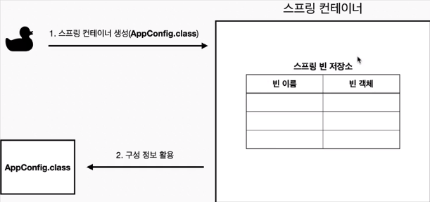

### Spring Container 생성

- `ApplicationContext`를 `SpringContainer` 라고 한다.
- `ApplicationContext`는 인터페이스이다.
- `SpringContainer`는 XML 기반으로 만들 수 있으며, Annotation 기반으로 만들 수 있다.
- Java 설정 Class 기반으로 `SpringContainer`를 만드는 법
    1. `new AnnotationConfigApplicationContext(AppConfig.class);`
    2. `AnnotationConfigApplicationContext`는 `ApplicationContext`의 구현체이다.
- Container란? 객체를 담고 있는 것을 말한다.
- `SpringContainer`는 `BeanFactory`, `ApplicationContext`로 구분지어 이야기한다. 다만 일반적으로 `BeanFactory`를 직접 사용하지
  않고 `ApplicationContext`를 사용한다.

## `SpringContainer`의 생성과정

### 1. `SpringContainer` 생성

- `SpringContainer`에는 SpringBean 저장소가 존재
- `SpringContainer`를 생성할 때는 구성 정보 입력 필요(Java, XML, Annotation): `AppConfig.class`

### 2. `SpringBean` 등록

- `SpringContainer`는 파라미터로 넘어온 설정 클래스(`AppConfig.class`)를 사용하여 `SpringBean`을 등록한다.
*Bean 이름*
- `SpringBean`의 이름은 기본적으로 메서드 이름을 사용한다.
- `SpringBean`의 이름을 직접 부여할 수 있다.
  - `@Bean(name = "memberService2")`

*주의: Bean 이름은 항상 다른 이름을 부여*해야 한다.
동일한 이름으로 선언되는 경우, 다른 Bean이 무시되거나, 기존 Bean을 덮어버리거나 설정에 따라 오류가 발생한다.
**최근**에는 중복으로 선언된 경우 `SpringBoot`에서 오류를 발생시킨다.

### 3. *`SpringBean` 의존관계 설정-준비*

### 4. *`SpringBean` 의존관계 설정-완료*

- `SpringContainer`는 설정 정보를 참고하여 의존관계를 주입(DI)한다.
- `SpringBean`을 생성하고 의존관계를 주입하는 단계를 **생성과정**이라 한다.
- 생성과정을 거치면서 의존관계 주입이 완료된 `SpringBean`은 `SpringContainer`에서 관리한다.
- 단순하게 Java 코드를 호출하는 것 같지만 차이가 존재함.
