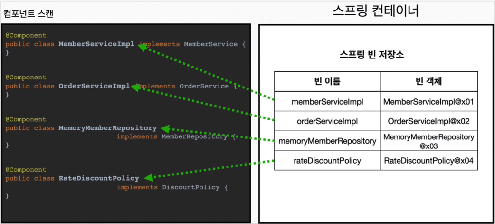
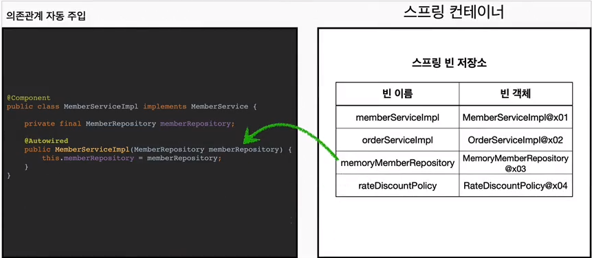

## ComponentScan과 의존관계 자동 주입
- 지금까지는 Java => @Bean, XML => <bean/>을 통해 Bean을 등록했다.
- 이번에는 ComponentScan을 통해 Bean을 등록하는 방법을 알아보자.
- Spring은 설정 정보 없이 자동으로 스프링 빈을 등록하는 `ComponentScan` 기능을 제공한다.
- 또한 의존 관계도 자동으로 주입하는 `Autowired` 기능도 제공한다.

- 이전에 AppConfig에서 @Bean으로 직접 설정 정보 작성, 의존관계 직접 명시.
- @ComponentScan을 사용하면 설정 정보가 없기 때문에, 의존관계 주입도 클래스 안에서 해결 필요.
- `@Autowired`를 사용하면 스프링 컨테이너가 자동으로 의존관계를 주입해준다.

### *1. @ComponentScan*

- `@ComponentScan`은 `@Component` 애노테이션이 붙은 클래스를 스캔해서 스프링 빈으로 등록한다.
- `@Configuration`이 붙은 클래스도 스프링 빈으로 등록된다.
- 이때 스프링 빈의 기본 이름은 클래스명을 사용하되, 맨 앞글자만 소문자를 사용한다.
  - **빈 이름 기본 전략**: MemberServiceImpl 클래스 => memberServiceImpl
  - **빈 이름 직접 지정**: `@Component("memberService2")` => memberService2

### *2. @Autowired*

- 생성자에 `@Autowired`를 지정하면, 스프링 컨테이너가 자동으로 해당 스프링 빈을 찾아서 주입한다.
- 이때 기본 조회 전략은 타입이 같은 빈을 찾아서 주입한다.
  - **getBean(MemberRepository.class)**와 동일하다.
  - **빈 이름으로 조회**: `@Autowired` `private MemberRepository memberRepository;`
