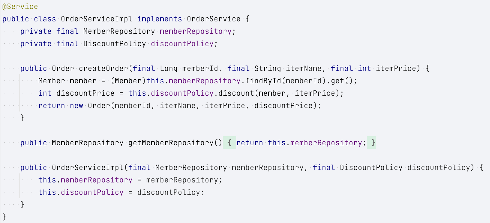

## 다양한 의존관계 주입 방법

1. 생성자 주입
2. 수정자 주입(setter 주입)
3. 필드 주입
4. 일반 메서드 주입

#### 생성자 주입

- 특징
    1. 생성자 호출 시점에 딱 1번만 호출되는 것이 보장된다.
    2. **불변**, **필수** 의존관계에 사용
- 생성자가 딱 1개만 있으면 `@Autowired`를 생략해도 자동 주입 된다.

#### 수정자 주입(setter 주입)

1. 선택, 변경 가능성이 있는 의존관계에 사용
2. 자바빈 프로퍼티 규약의 수정자 메서드 방식을 사용하는 방법이다.

### 필드 주입

1. 코드가 간결해서 많은 개발자들을 유혹하지만 외부에서 변경이 불가능해서 테스트 하기 힘들다는 치명적인 단점이 있다.
    - DI 프레임워크가 없으면 아무것도 할 수 없다.
2. 사용하지 말자!
    - 스프링이나, 외부 라이브러리에서도 사용하지 않는다.
    - Application 실제 코드와 관계 없는 테스트 코드
    - 스프링 설정을 목적으로 하는 @Configuration 같은 곳에서만 특별한 용도로 사용

### 일반 메서드 주입

1. 일반 메서드를 통해서 주입 받을 수 있다.
2. 일반적으로 사용 X

## 옵션 처리

```java
    static class TestBean {
    // Member는 스프링 빈이 아니다.
    // required = false로 설정하면 의존관계가 없으면 메서드 자체가 호출 안됨
    @Autowired(required = false)
    public void setNoBean1(final Member noBean1) {
        System.out.println("noBean1 = " + noBean1);
    }

    // @Nullable로 설정하면 의존관계가 없으면 null이 입력된다.
    @Autowired
    public void setNoBean2(@Nullable final Member noBean2) {
        System.out.println("noBean2 = " + noBean2);
    }

    // Optional로 설정하면 의존관계가 없으면 Optional.empty가 입력된다.
    @Autowired
    public void setNoBean3(final Optional<Member> noBean3) {
        System.out.println("noBean3 = " + noBean3);
    }
}
```

## 생성자 주입을 선택해라!

**불변**

- 대부분의 의존관계 주입은 한번 일어나면 애플리케이션 종료 시점까지 의존관계를 변경할 일이 없다.
- 오히려 종료 전까지 변경하면 안된다.(불변)

**누락**

- 프레임 워크 없이 순수한 자바 코드를 단위 테스트 하는 경우에 의존성 누락을 빠르게 확인할 수 있다.

**final**

- 생성자 주입을 사용하면 필드에 final 키워드를 사용할 수 있다.
- 생성자에서 혹시라도 값이 설정되지 않는 오류를 컴파일 시점에 막아준다.

**정리**

- 생성자 주입 방식을 선택하는 이유 => 프레임 워크에 의존하지 않고, 순수한 자바 언어의 특징을 잘 살리는 방법이기 때문이다.
- 기본으로 생성자 주입을 사용하고, 필수 값이 아닌 경우에는 수정자 주입 방식을 옵션으로 부여하면 된다.
- 필수값이 아닌 경우 수정자 주입을 옵션으로 사용 가능

### 롬복과 최신 트랜드
- `@RequiredArgsConstructor` : final이 붙은 필드를 모아서 생성자를 자동으로 만들어준다.

